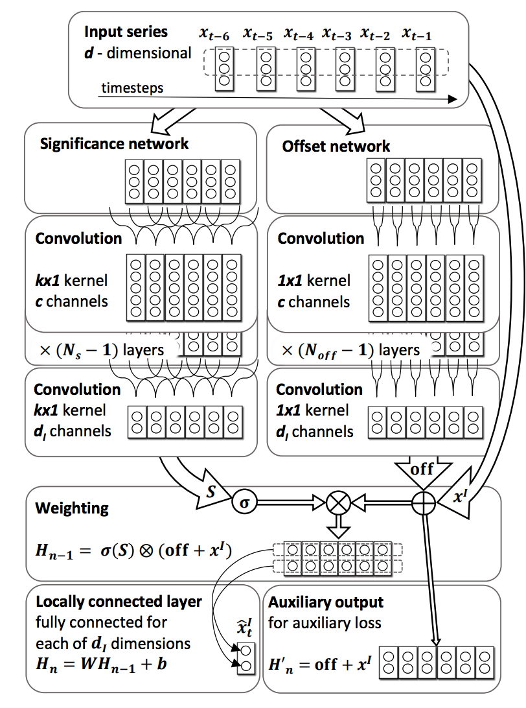

# Autoregressive-Convolutional-Neural-Networks

https://arxiv.org/pdf/1703.04122.pdf

<!-- $\hat { y } _ { n } = \sum _ { m = 1 } ^ { M } W _ { \cdot , m } \otimes \left( \operatorname { off } \left( x _ { n - m } \right) + x _ { n - m } ^ { I } \right) \otimes \sigma \left( S _ { \cdot , m } \left( \mathbf { x } _ { n } ^ { - M } \right) \right) $ -->

<!-- 
  -->


## Model 



## Run
```python
python main.py
```